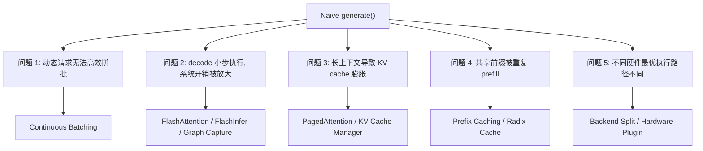
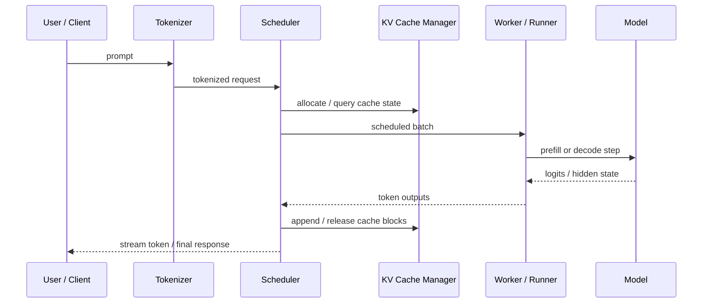
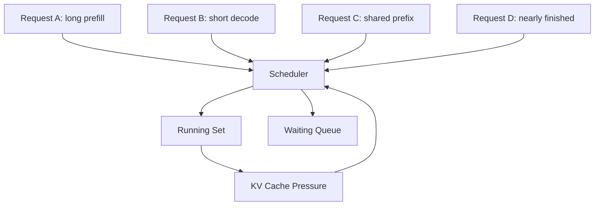
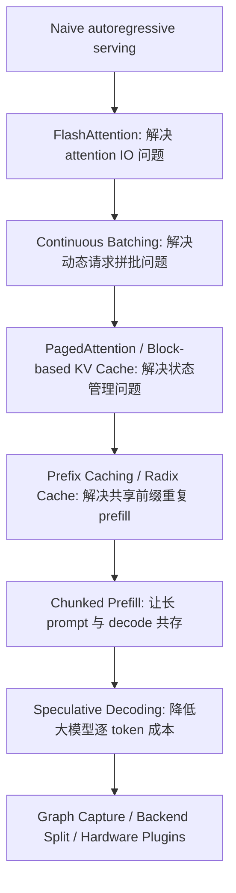
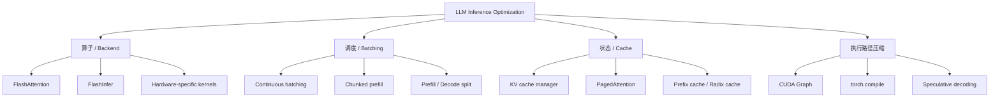
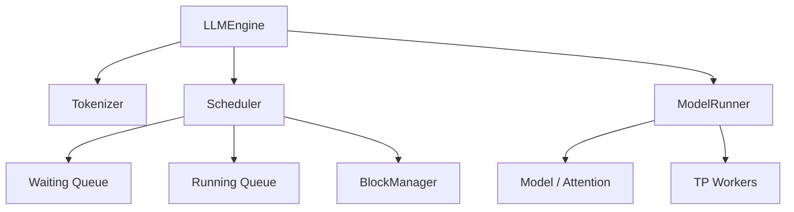

# 第 1 节：从 Hugging Face `generate()` 到现代 LLM 推理系统

## 本节导读

很多 NLP researcher 第一次接触 inference infra 时，会有一种天然直觉：

- 模型已经训练完了，推理无非就是跑 `forward()` 或 `generate()`
- 如果某个系统更快，原因大概是它用了更强的 attention kernel
- serving 只是“把单机推理包一层 API server”

这些直觉抓住了一部分事实，但都不够完整。

现代 LLM 推理系统真正要面对的是一组同时存在的系统约束：

- 请求是动态到达的，不是离线整齐排好的
- prompt 和 output 长度分布很宽，workload 强烈异质
- decode 阶段单步计算小，但状态依赖重，系统开销会被无限放大
- 长上下文让 KV cache 快速膨胀，显存 / NPU memory 管理变成核心问题
- 系统既要追求吞吐，也要考虑 TTFT、TPOT、P95/P99 latency
- 不同硬件的最优执行路径不一样，backend 与 plugin 变得重要

因此，LLM inference optimization 不是若干 isolated tricks 的拼接，而是一门系统工程。

这一节的目标，是建立后两节都要依赖的基本心智模型：以后你看到 continuous batching、PagedAttention、prefix cache、FlashInfer、chunked prefill、speculative decoding 这些术语时，能立刻判断它们在解决哪一类瓶颈。

## 学习目标

完成本节后，你应该能够：

1. 解释一次 LLM request 从进入系统到返回结果的完整路径。
2. 区分 prefill 和 decode 的资源画像、性能目标与典型瓶颈。
3. 理解为什么 continuous batching、KV cache、PagedAttention、prefix caching 会成为行业关键技术。
4. 把近几年主流 inference optimization 放进一张统一地图中。
5. 用 `nano-vllm` 建立一个最小推理引擎的结构化理解。

## 1. 一张总图：这个行业到底在优化什么

先看这张图，再进入细节。



这张图的重点不是“记住这些名词”，而是先形成一个判断框架：

- 如果一个技术在解决动态请求管理问题，它多半和 batching / scheduler 有关
- 如果一个技术在解决长上下文状态问题，它多半和 KV cache / page / block 有关
- 如果一个技术在解决执行路径问题，它多半和 attention backend、graph、kernel 特化有关

从现在开始，尽量不要把推理优化理解成“某个库更快”，而要理解成“某个技术击中了某种系统瓶颈”。

## 2. 从单请求 `generate()` 到服务系统：问题是怎么出现的

### 2.1 最朴素的推理过程

如果只考虑单个请求，推理看起来很简单：

1. 收到文本输入
2. tokenizer 编码
3. 把 token 喂给模型
4. 自回归地产生下一个 token
5. 把下一个 token 拼回序列
6. 重复直到达到停止条件

用伪代码写，大概是这样：

```python
prompt_tokens = tokenizer.encode(prompt)
state = None

for step in range(max_tokens):
    logits, state = model.forward(prompt_tokens if step == 0 else [next_token], state)
    next_token = sample(logits)
    output.append(next_token)
    if next_token == eos:
        break
```

这个过程在“功能正确性”上没有问题，但一旦你把它放进真实服务环境，问题就开始出现。

### 2.2 为什么服务场景会把问题放大

真实线上请求很少满足“同长度、同时间到达、同生成长度”的理想条件。更常见的是：

- 某些请求只有几十个输入 token
- 某些请求有几千甚至几万 token 的 prompt
- 某些请求只生成 1 到 8 个 token
- 某些请求要生成几百甚至上千个 token
- 请求到达并不整齐，而是随时间动态涌入

这意味着服务系统面对的不是“一个很大的矩阵乘法”，而是“许多生命周期不同的请求，需要共享同一组硬件资源”。

### 2.3 服务系统不是单次推理的简单放大

从系统视角看，在线推理多出来的困难主要有四类：

1. 调度问题
   - 谁先执行
   - 哪些请求可以一起组成 batch
   - 长短请求如何共存
2. 状态问题
   - 生成中的请求需要长期保存中间状态
   - 这些状态如何分配、扩展、回收
3. 执行问题
   - 哪个 backend 最适合当前 workload
   - 哪些部分能 graph capture / compile
4. 指标问题
   - 用户关心的是 TTFT、P95 latency，而不是只有平均 tokens/s

也正因为这些额外问题存在，LLM inference 才逐渐变成一个独立的系统方向。

## 3. 一次 request 的生命周期

先建立一个统一的数据流图。



这张图非常重要，因为后面看任何 serving 框架，你都可以用它来定位对象：

- `Tokenizer` 对应输入处理层
- `Scheduler` 对应控制平面
- `KV Cache Manager` 对应状态管理层
- `Worker / Runner` 对应执行平面
- `Model` 对应真正的计算后端

如果你能把一个仓库里的代码映射到这五个角色上，基本就抓住主干了。

## 4. Prefill 与 Decode：必须先分清的两类问题

### 4.1 Prefill 是什么

prefill 指的是：把 prompt 整段送入模型，并建立后续 decode 所需要的上下文状态。

如果 prompt 很长，prefill 往往会表现为：

- query length 大
- 张量规模更大
- 单轮计算更重
- 更容易形成高吞吐的大块计算

### 4.2 Decode 是什么

decode 指的是：在已有上下文状态上逐 token 继续生成。

典型 decode 的特点是：

- 一步只处理 1 个新 query token
- 每一步计算量不大
- 但步数很多
- 状态依赖强
- 系统开销、memory bandwidth、cache layout 和调度影响会被显著放大

### 4.3 一张对照表

| 维度 | Prefill | Decode |
| --- | --- | --- |
| 输入新 token 数 | 通常较大 | 通常为 1 |
| 关注指标 | TTFT, prompt ingest throughput | TPOT, ITL, tail latency |
| 常见瓶颈 | 长上下文、显存、prefill backend | cache、bandwidth、scheduler、launch overhead |
| 典型优化 | chunked prefill、prefill backend | KV cache、continuous batching、decode backend |
| 是否容易受共享前缀影响 | 非常容易 | 间接影响 |

### 4.4 为什么这个区分如此关键

很多看似统一的“推理优化”，其实只在某一个阶段有效。

例如：

- prefix caching 本质上是在减少重复 prefill
- KV cache 管理几乎直接决定 decode 可扩展性
- 某些 backend 对 prefill 更优，但 decode 并不一定占优
- TTFT 更受 prefill 影响，TPOT 更受 decode 影响

所以只说“某框架更快”是远远不够的。至少要问清楚：它是在什么 workload、什么阶段、什么指标上更快。

## 5. 推理系统的第一性原理

理解 inference infra，推荐先抓四个约束，而不是先背一堆术语。

## 5.1 约束一：算力不是唯一瓶颈

研究者通常天然关注 FLOPs，这没有错，但在服务场景里，很多时候真正拖慢系统的不是“计算不够多”，而是：

- HBM 带宽
- cache 读写模式
- kernel launch 开销
- host-device 协同
- 批次形成不合理导致的空转

这正是 FlashAttention 这类工作如此重要的原因之一。它提醒我们：真实系统里，IO pattern 可能和算术复杂度一样重要。

## 5.2 约束二：状态会长期存在

训练时，很多中间状态只是短暂存在；但 serving 里的 KV cache 会随着请求生命周期长期保留。

因此系统必须持续回答：

- 状态放哪里
- 如何扩展
- 如何回收
- 如何跨请求复用
- 如何避免碎片化

如果不理解这一点，就很难理解为什么 KV cache 管理会成为架构中心。

## 5.3 约束三：请求到达是动态的

真实服务不是“凑齐一个大 batch 再统一执行”，而是不断有新请求进入、老请求结束、中间请求继续 decode。

这意味着：

- batch 是动态对象，不是静态数组
- request lifecycle 会直接影响吞吐和延迟
- scheduler 会从“工程细节”上升为“系统主逻辑”

### 一张更直观的图



这张图想表达的是：scheduler 并不是单向下发命令，它必须持续感知 cache 压力、活跃请求集合和新请求到达。

## 5.4 约束四：同一优化不一定跨硬件成立

在 NVIDIA GPU 上表现最好的路径，不一定在 Ascend 上仍然最好；同样，Hopper / Blackwell 上适用的 backend 与图优化，也不一定适合别的平台。

因此现代 serving 框架越来越强调：

- backend 可切换
- prefill 与 decode 可以分开选 backend
- graph / kernel / plugin 层要做硬件特化

这也是为什么后续你会看到：

- vLLM 有 attention backend / platform 选择
- SGLang 显式暴露 `attention_backend`、`prefill_attention_backend`、`decode_attention_backend`
- `vllm-ascend` 把硬件 plugin 作为正式架构层

## 6. 行业关键技术：这几年大家到底在解决什么

这一部分不是历史故事，而是帮助你建立一个统一的技术坐标系。

## 6.1 技术演进的主线



这条链路非常适合记忆，因为它不是按论文名排列，而是按“系统瓶颈的暴露顺序”排列。

## 6.2 FlashAttention：让大家意识到 attention 的瓶颈不只是公式复杂度

FlashAttention 的意义不仅在于“更快”，更在于它改变了行业对 attention 的理解方式。

它强调的是：

- attention 的中间结果 materialization 很贵
- 显存读写路径和 tile 组织方式很重要
- IO-aware 设计可以显著改变实际性能

从系统视角看，它给整个领域上了一课：

> 一个算子是否高效，不能只看数学表达式，还要看真实的数据流。

这也是后来很多推理后端优化的思想起点。

## 6.3 Continuous Batching：为什么它几乎定义了现代 LLM serving

如果只会静态 batching，那么在线服务通常只能这样做：

- 收一批请求
- 等一等
- 凑齐以后执行

问题在于，真实请求生命周期不同：

- 某些请求刚进来，正要 prefill
- 某些请求已经在 decode 第几十步
- 某些请求马上结束

Continuous batching 的核心思想是：

- batch 是动态维护的集合
- 新请求可以不断插入
- 完成请求可以不断移除
- 系统尝试让设备持续处于高利用状态

它之所以重要，是因为它直接影响：

- GPU 利用率
- tokens/s
- TTFT
- tail latency

很多现代 serving 框架的“感觉很强”，本质上都和它能否把 continuous batching 做好有关。

## 6.4 PagedAttention：为什么它不只是“一个更快的 attention”

当请求数量变多、上下文变长、生命周期变复杂时，KV cache 管理会成为难点。

粗暴的连续内存管理会遇到：

- 分配不灵活
- 内存碎片
- 长短请求混合时效率差
- 请求提前结束或被抢占时很难回收

PagedAttention 的历史意义，在于它把“attention 计算”和“KV cache 内存组织”连成一个系统问题来看。

所以从架构角度看，它的价值在于：

- 让 cache 组织更灵活
- 让动态 serving 场景下的状态管理更可控
- 为后续 prefix cache、chunked prefill 等机制提供更稳的基础

## 6.5 Prefix Caching / Radix Cache：把共享前缀真正变成收益

很多真实 workload 都有共享前缀：

- 相同 system prompt
- 相同工具说明
- 相同模板或 instruction
- 同一批评测任务共享引导词

如果系统看不见这个结构，就会重复做一样的 prefill。

Prefix caching 的目标就是：

- 识别共享前缀
- 复用已有 cache 状态
- 避免重复 prefill

SGLang 的 radix cache / prefix-aware runtime 之所以值得学，不是因为名词新，而是因为它把“共享前缀”从文本层面的问题，变成了运行时对象层面的问题。

### 但要注意一个常见误解

prefix cache 并不是总是“白赚”的。

如果 workload 几乎不共享前缀，那么：

- cache 命中率会低
- 维护 cache 的额外开销未必值得
- benchmark 结果也可能不显著

这也是为什么后面实验设计里，workload 定义会比框架名字更重要。

## 6.6 Chunked Prefill：长上下文时代的必要折中

上下文长度增加以后，prefill 本身会越来越重。如果系统总是整段 prompt 一次性做完，会带来明显问题：

- TTFT 变差
- 正在 decode 的请求可能被饿死
- 系统资源被大 prompt 独占

Chunked prefill 的核心思想是：

- 把长 prefill 切成更可控的块
- 让 prefill 与 decode 更容易在同一系统中共存
- 把吞吐、延迟与资源占用做更细粒度折中

所以它本质上是一个系统调度策略，而不是仅仅一个 kernel trick。

## 6.7 Speculative Decoding：重新思考“每个 token 都要完整大模型算一遍”

自回归生成的一个天然难点，是 decode 每一步都依赖上一步结果。如果每个 token 都必须完全走一遍昂贵大模型路径，成本会很高。

Speculative decoding 的思路是：

- 先让便宜路径提出候选
- 再让贵路径验证

这类方法重要的地方在于，它让“逐 token decode 的串行成本”本身变成可优化对象。

即使你这门课不重点讲 spec decode 的数学细节，也应该理解它在系统版图中的位置：它是 decode 优化的一条非常重要的支线。

## 6.8 Graph Capture / Backend Split / Hardware Plugins：从通用执行走向特化执行

当框架逐渐成熟后，另一个自然方向就是：

- 尽量减少 Python / eager overhead
- 把稳定的执行路径 graph capture 或 compile
- 在不同硬件上走最合适的 backend

这里会牵涉：

- CUDA Graph
- `torch.compile`
- FlashInfer
- TensorRT-LLM 风格后端
- 硬件 plugin

这一整条线的本质是：

> 现代 serving 框架不只是在调度请求，也在持续决定“本轮请求应该走哪条执行路径”。

## 7. 把这些技术归类：一张分类图



以后看到任何新优化时，可以先问：

- 它主要属于哪一类？
- 它在缓解什么瓶颈？
- 它更影响 prefill 还是 decode？

这比记住一堆命令和参数更有用。

## 8. 推理系统里的核心对象

接下来把上面的技术地图，收敛到真正的系统对象上。

## 8.1 Request / Sequence

在 serving 框架里，请求不只是“一段文本”，而是一个带生命周期的系统对象。

它通常至少包含：

- prompt token ids
- 当前已生成 token
- 最大输出长度
- 停止条件
- cache 状态
- 调度状态

这意味着一个 request 同时是：

- 一个模型输入对象
- 一个调度对象
- 一个资源占用对象

## 8.2 Scheduler

scheduler 绝不是普通的“排队器”。

它需要决定：

- 哪些请求先进入执行
- 哪些请求可以拼成同一轮 batch
- prefill 和 decode 如何共存
- 当 cache 压力变大时如何抢占或延后请求

所以，从系统角度看，scheduler 是推理框架的控制中枢。

## 8.3 KV Cache Manager

KV cache manager 要持续回答四类问题：

- 怎么分配
- 怎么追加
- 怎么回收
- 怎么复用

如果一个框架把这层做得很弱，那么随着并发、上下文和 workload 异质性增加，它几乎一定会在稳定性或吞吐上吃亏。

## 8.4 Worker / Model Runner

这一层负责把上面那些系统决策，真正变成一次设备执行。

它通常要处理：

- batch 张量组织
- 与模型结构对应的输入打包
- attention backend / sampler 调用
- 把输出 token 回传给 scheduler

如果说 scheduler 更像控制平面，那么 worker / model runner 更像执行平面。

## 9. 用 `nano-vllm` 建立最小心智模型

现在我们把抽象问题落到最小实现里。

`nano-vllm` 的价值不在于它覆盖了最多功能，而在于它足够小，能让你看清一个推理引擎最核心的部件。

## 9.1 先看系统结构图



这张图已经足够表达 `nano-vllm` 的最小结构：

- `LLMEngine` 负责总流程
- `Scheduler` 决定请求何时进入执行
- `BlockManager` 负责最简 KV cache block 管理
- `ModelRunner` 把批次送给模型

## 9.2 第一个关键代码片段：主循环到底长什么样

下面这个片段来自 `nano-vllm/nanovllm/engine/llm_engine.py`，它几乎就是一个最小推理引擎的骨架：

```python
def step(self):
    seqs, is_prefill = self.scheduler.schedule()
    token_ids = self.model_runner.call("run", seqs, is_prefill)
    self.scheduler.postprocess(seqs, token_ids)
    outputs = [(seq.seq_id, seq.completion_token_ids)
               for seq in seqs if seq.is_finished]
    return outputs, num_tokens
```

这几行非常值得仔细理解，因为它几乎把 serving 主循环压缩成了三个动作：

1. `schedule()`
   - 选择这轮要跑哪些请求
   - 决定当前是 prefill 还是 decode
2. `model_runner.run(...)`
   - 真正执行模型
3. `postprocess(...)`
   - 追加 token
   - 更新状态
   - 回收完成请求的资源

如果你以后读大仓库，总是找不到重点，可以先问自己：

- 这个框架的“三段式主循环”在哪里？

## 9.3 第二个关键代码片段：scheduler 如何区分 prefill 和 decode

下面这个片段来自 `nano-vllm/nanovllm/engine/scheduler.py`：

```python
def schedule(self) -> tuple[list[Sequence], bool]:
    # prefill
    scheduled_seqs = []
    ...
    while self.waiting and num_seqs < self.max_num_seqs:
        seq = self.waiting[0]
        if num_batched_tokens + len(seq) > self.max_num_batched_tokens:
            break
        ...
        scheduled_seqs.append(seq)
    if scheduled_seqs:
        return scheduled_seqs, True

    # decode
    while self.running and num_seqs < self.max_num_seqs:
        seq = self.running.popleft()
        ...
    return scheduled_seqs, False
```

这个实现很小，但教学价值很高，因为它清楚地表达了三件事：

1. scheduler 明确区分 waiting 与 running
2. prefill 先尝试从 waiting queue 拉请求
3. 如果没有新的 prefill，就继续处理 running set 的 decode

这就是为什么我们说：serving 系统的核心不是“跑模型”，而是“管理不同生命周期的请求集合”。

## 9.4 第三个关键点：BlockManager 为什么重要

虽然 `nano-vllm` 的 block 管理比工业框架简单很多，但它已经足够让你看到下面这个事实：

- cache 管理不是附属细节
- scheduler 能否继续放入请求，直接取决于 cache 是否还能分配 / 追加

在 `scheduler.py` 里你会看到类似逻辑：

```python
if ... or not self.block_manager.can_allocate(seq):
    break
...
while not self.block_manager.can_append(seq):
    ...
```

这说明：

- 调度和 cache 不是两张皮
- “本轮能不能多跑一点”不是只看 batch size，也看状态空间是否足够

这正是后来 vLLM 把 PagedAttention / KV cache manager 做成架构中心的根本原因。

## 9.5 把概念和代码一一对应

| 系统概念 | `nano-vllm` 对应代码 | 你应该关注的问题 |
| --- | --- | --- |
| Request / Sequence | `engine/sequence.py` | 请求状态如何被表示 |
| Scheduler | `engine/scheduler.py` | waiting / running 如何切换 |
| Cache 管理 | `engine/block_manager.py` | 何时 allocate / append / free |
| 执行平面 | `engine/model_runner.py` | batch 如何进入模型 |
| 主控制循环 | `engine/llm_engine.py` | 调度、执行、回收如何连接 |

这张对照表非常重要，因为后面读 vLLM 和 SGLang 时，本质上就是在寻找这些角色在大工程里的更复杂版本。

## 10. 如何带着问题进入第 2 节

到这里，你已经具备了一张基本地图。进入真实大仓库前，建议把下面这些问题带在脑子里：

1. 这个框架的主循环在哪里？
2. 它的 scheduler 输入和输出是什么？
3. 它如何管理 KV cache？
4. 它是否把 prefill 和 decode 当成不同问题对待？
5. backend 是在哪里被选择的？

如果你读代码时一直带着这些问题，效率会比从头到尾顺着文件看高很多。

## 11. 本节总结

本节最重要的不是记住术语，而是建立一套判断系统问题的框架：

- LLM serving 不是单次 `generate()` 的放大版，而是 request lifecycle 管理问题
- prefill 和 decode 必须分开看，因为它们的瓶颈和优化目标不同
- 近几年行业关键技术基本都围绕 batching、cache、backend、执行路径压缩这几条线展开
- continuous batching、PagedAttention、prefix caching 之所以重要，是因为它们分别击中了动态请求、状态管理和共享前缀这几个核心矛盾
- `nano-vllm` 虽然小，但已经足够展示一个推理引擎最关键的骨架

## 12. 思考题

1. 为什么说 continuous batching 是系统层创新，而不是局部实现技巧？
2. 在什么 workload 下，prefix caching 可能几乎没有帮助？
3. 为什么 decode 阶段常常比 prefill 更容易暴露系统设计问题？
4. 如果一个系统吞吐很高，但 TTFT 很差，它更可能在哪些环节出了问题？

## 13. 课后阅读建议

完成本节后，建议你先读下面四个文件：

- `nano-vllm/nanovllm/engine/llm_engine.py`
- `nano-vllm/nanovllm/engine/scheduler.py`
- `nano-vllm/nanovllm/engine/block_manager.py`
- `nano-vllm/nanovllm/engine/model_runner.py`

阅读目标不是逐行解释，而是回答这四个问题：

1. request 在哪里进入系统？
2. batch 在哪里形成？
3. cache 是谁管理的？
4. 真正执行模型的是哪一层？
