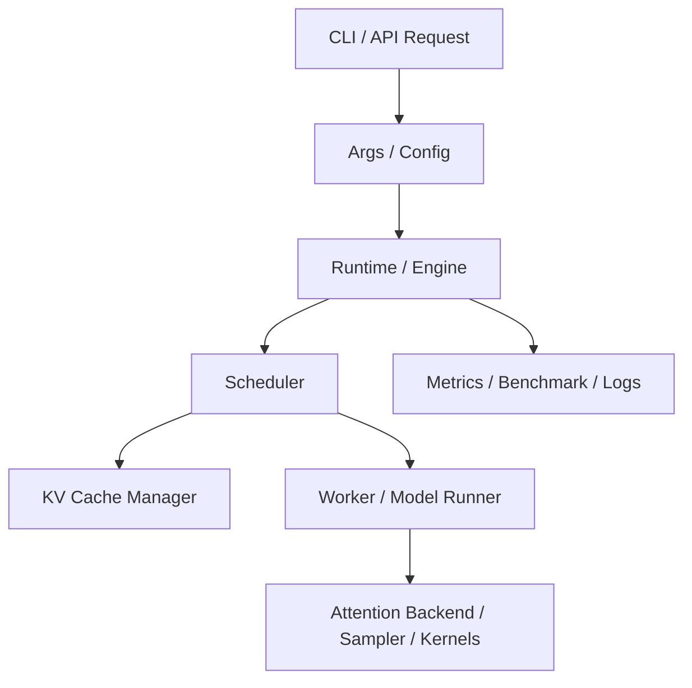
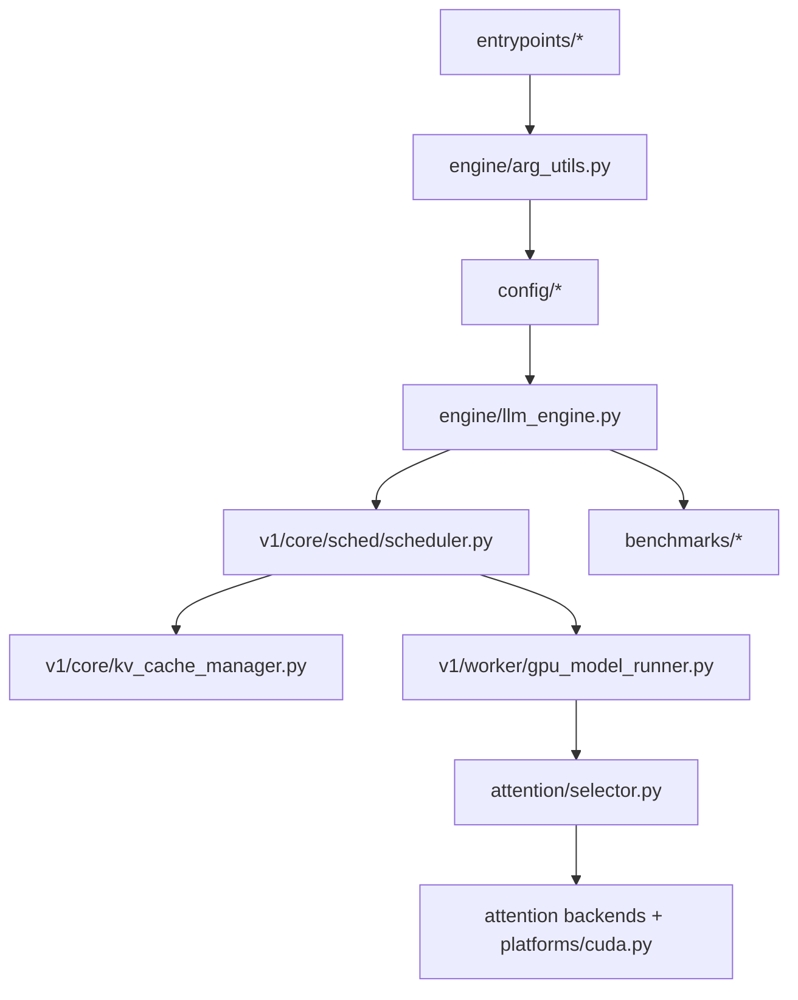
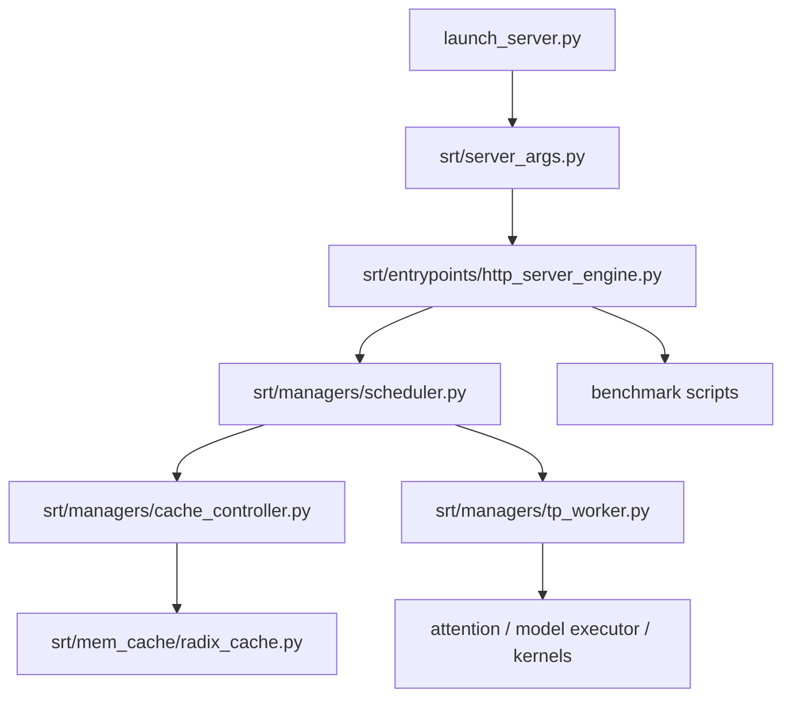
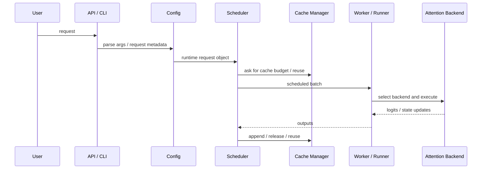

# 第 2 节：vLLM 与 SGLang 源码导读：从系统抽象到工程实现

## 本节导读

第 1 节我们已经建立了一套基本判断框架：

- inference optimization 不是参数罗列，而是系统设计问题
- 真正重要的对象是 request、scheduler、KV cache、worker、backend
- 看一个推理系统，应该先问“它在解决什么瓶颈”，再问“它用了什么实现”

第 2 节要做的，就是把这些抽象落到真实仓库中。

很多初学者读 serving 框架时会踩一个常见坑：一上来就打开最底层的 attention kernel，然后很快迷失。更高效的方法是：

1. 先找入口
2. 再找配置
3. 再找 scheduler
4. 再找 cache manager
5. 再找 worker / model runner
6. 最后才去看 backend 与 kernel

原因很简单：服务框架真正复杂的地方，不在某一个函数怎么写，而在整个执行路径如何组织。

## 学习目标

完成本节后，你应该能够：

1. 在 vLLM 与 SGLang 中快速定位“入口、配置、调度、cache、worker、benchmark”六类关键位置。
2. 用统一的系统语言描述两个框架的核心设计。
3. 理解为什么同样叫 `attention backend`，不同框架暴露方式和控制粒度会不一样。
4. 把第 1 节的抽象对象映射到真实工程实现。
5. 为后面的 benchmark、调优和实验报告建立源码级证据链。

## 1. 读 serving 框架的统一模板

下面这张图非常值得反复使用。以后你遇到别的 serving 框架，也可以先按这个模板去找对象。



这张图看起来抽象，但它有一个很大的好处：它帮助你把不同仓库的代码结构还原成相同抽象层。

### 第一次读代码时该问的六个问题

1. 用户请求从哪里进入系统？
2. 参数和配置在哪里收敛？
3. request / sequence 在哪里形成？
4. scheduler 在哪里做决策？
5. KV cache 由谁管理？
6. worker / runner 在哪里把系统决策变成真正执行？

如果这六个问题回答清楚了，你对这个框架的理解通常已经超过“会用命令行”的层面。

## 2. vLLM：从 PagedAttention 思想到完整 serving 框架

vLLM 的行业影响力，很大程度上来自下面两件事：

- 它把 KV cache 的分页化管理思想工程化了
- 它把高吞吐 serving 做成了一套相对通用的系统

所以阅读 vLLM 时，不应该只把它看成“一个可以跑模型的库”，而应该把它看成一整套围绕动态请求、状态管理和后端执行组织起来的系统。

## 2.1 vLLM 的源码地图

在你当前工作区里，`vllm` 已经切到了 `v0.12.0`。这个版本下，适合第 2 节阅读的主要路径如下：

- 入口层
  - `vllm/vllm/entrypoints/llm.py`
  - `vllm/vllm/entrypoints/openai/api_server.py`
  - `vllm/vllm/entrypoints/cli/serve.py`
- 配置层
  - `vllm/vllm/engine/arg_utils.py`
  - `vllm/vllm/config/cache.py`
  - `vllm/vllm/config/scheduler.py`
  - `vllm/vllm/config/attention.py`
- 核心运行时
  - `vllm/vllm/engine/llm_engine.py`
  - `vllm/vllm/v1/core/sched/scheduler.py`
  - `vllm/vllm/v1/core/kv_cache_manager.py`
  - `vllm/vllm/v1/worker/gpu_model_runner.py`
  - `vllm/vllm/v1/worker/gpu/model_runner.py`
- attention / backend 层
  - `vllm/vllm/attention/selector.py`
  - `vllm/vllm/attention/backends/registry.py`
  - `vllm/vllm/platforms/cuda.py`
- benchmark 层
  - `vllm/vllm/benchmarks/throughput.py`
  - `vllm/vllm/benchmarks/serve.py`
  - `vllm/vllm/benchmarks/latency.py`

## 2.2 vLLM 的结构图



这张图刻意强调一件事：vLLM 的后端选择不是孤立动作，它是在请求已经进入 engine、配置已经收敛、scheduler 和 worker 已经形成分工之后发生的。

## 2.3 入口层：请求是怎么进系统的

建议先读：

- `vllm/vllm/entrypoints/llm.py`
- `vllm/vllm/entrypoints/openai/api_server.py`

阅读这一步时，重点不是 HTTP 细节，而是回答：

- 用户是通过哪些方式把请求交给 vLLM 的？
- Python API、CLI 和 OpenAI-compatible server 最终是否汇聚到同一套运行时？
- 哪一层负责把用户侧概念转成 engine 概念？

从教学角度看，这一步的价值在于让你意识到：一个成熟的 serving 框架通常会把“用户交互方式”和“底层推理引擎”解耦。

## 2.4 配置层：很多性能行为在这里就决定了

建议阅读：

- `vllm/vllm/engine/arg_utils.py`
- `vllm/vllm/config/cache.py`
- `vllm/vllm/config/scheduler.py`
- `vllm/vllm/config/attention.py`

很多人低估配置层的重要性，但从系统视角看，配置层其实在回答三个关键问题：

1. 系统准备如何调度请求？
2. 系统准备如何管理 cache？
3. 系统准备走哪条执行后端？

因此：

- `cache.py` 决定状态管理策略
- `scheduler.py` 决定 batch 与 token budget 约束
- `attention.py` 决定执行层选择空间

如果不知道这些配置最终落在哪些对象上，后面 benchmark 和调优就很容易变成“改了参数，但不知道系统究竟变了什么”。

## 2.5 scheduler：vLLM 的控制中枢

建议重点阅读：

- `vllm/vllm/v1/core/sched/scheduler.py`

先看一小段初始化代码：

```python
self.max_num_running_reqs = self.scheduler_config.max_num_seqs
self.max_num_scheduled_tokens = self.scheduler_config.max_num_batched_tokens
...
self.waiting = create_request_queue(self.policy)
self.running: list[Request] = []
...
self.kv_cache_manager = KVCacheManager(
    kv_cache_config=kv_cache_config,
    max_model_len=self.max_model_len,
    enable_caching=self.cache_config.enable_prefix_caching,
    ...
)
```

这个片段非常值得停下来理解。它说明 scheduler 初始化时就已经绑定了三类东西：

1. 调度预算
   - `max_num_seqs`
   - `max_num_batched_tokens`
2. 请求集合
   - `waiting`
   - `running`
3. 状态管理器
   - `kv_cache_manager`

也就是说，在 vLLM 里，scheduler 从一开始就不是一个单独的队列管理器，而是一个同时知道“请求集合 + token budget + cache 状态”的中心对象。

## 2.6 为什么 vLLM 的 scheduler 值得仔细读

在 `schedule()` 函数的开头，你会看到一段非常关键的注释：

```python
# There's no "decoding phase" nor "prefill phase" in the scheduler.
# Each request just has the num_computed_tokens and num_tokens_with_spec.
# ...
# This is general enough to cover chunked prefills, prefix caching,
# speculative decoding, and the "jump decoding" optimization in the future.
```

这段注释很有代表性，因为它体现了 vLLM 的一个设计取向：

- scheduler 尽量用统一的 token 进度模型来描述请求
- 不把 prefill 和 decode 在控制逻辑上硬切成两套系统
- 让 chunked prefill、prefix caching、spec decode 都能被统一纳入调度框架

这背后其实是一种很强的系统设计思想：用统一抽象去覆盖多种优化机制。

## 2.7 vLLM 的 KV cache manager：PagedAttention 思想的落点

建议阅读：

- `vllm/vllm/v1/core/kv_cache_manager.py`
- `vllm/vllm/v1/core/kv_cache_coordinator.py`

阅读这部分时，重点不是逐行看数据结构，而是先回答：

- cache 的分配由谁控制？
- scheduler 如何知道 cache 是否足够？
- prefix caching 是在哪里真正体现成“状态复用”的？

这一步的核心理解是：

- vLLM 把 cache 管理视作正式系统层
- cache 管理不是 model runner 的附属工作
- cache 约束会直接反向影响调度

所以很多 vLLM 的性能表现，本质上来自“调度器与 cache 管理器的协同”。

## 2.8 worker / model runner：从系统计划到真正执行

建议阅读：

- `vllm/vllm/v1/worker/gpu_model_runner.py`
- `vllm/vllm/v1/worker/gpu/model_runner.py`

这一层最重要的价值，是让你看到系统层对象是怎样变成真正设备执行输入的。

你应该重点观察：

- scheduler 输出的 batch 在这里长什么样
- KV cache 元数据如何与张量布局关联起来
- attention backend 是什么时候决定的

## 2.9 attention backend：vLLM 如何选择执行路径

建议阅读：

- `vllm/vllm/attention/selector.py`
- `vllm/vllm/attention/backends/registry.py`
- `vllm/vllm/platforms/cuda.py`

下面这段来自 `attention/selector.py`：

```python
backend_by_env_var: str | None = envs.VLLM_ATTENTION_BACKEND
...
selected_backend = AttentionBackendEnum[backend_by_env_var]
...
attention_cls = current_platform.get_attn_backend_cls(
    selected_backend,
    head_size,
    dtype,
    kv_cache_dtype,
    block_size,
    ...
)
```

这段代码非常适合教学，因为它把 backend 选择链条写得很清楚：

1. 先看是否有显式 override
2. 再看环境变量
3. 再交给当前平台去做合法性与具体类选择

这说明：

- backend 是正式抽象，不是散落在代码里的 if-else
- “我把环境变量设成某个值”不等于“系统一定走到了那个 backend”
- 硬件平台本身也参与 backend 选择

这也是为什么后面实验和考核时，不能只看启动命令，必须有日志和行为证据。

## 3. SGLang：更显式地暴露 runtime 策略与 backend 选择

SGLang 很适合教学，因为它把很多 runtime 决策和后端选择暴露得更直接。你能更清楚地看到：

- prefix-aware serving 是如何进入运行时设计的
- prefill 与 decode backend 可以如何分开控制
- scheduler、cache 和 worker 是如何围绕 runtime 组织起来的

## 3.1 SGLang 的源码地图

适合课程阅读的主要路径如下：

- 入口 / 配置
  - `sglang/python/sglang/launch_server.py`
  - `sglang/python/sglang/srt/server_args.py`
  - `sglang/python/sglang/srt/environ.py`
- 运行时入口
  - `sglang/python/sglang/srt/entrypoints/http_server.py`
  - `sglang/python/sglang/srt/entrypoints/http_server_engine.py`
- 核心调度与执行
  - `sglang/python/sglang/srt/managers/scheduler.py`
  - `sglang/python/sglang/srt/managers/cache_controller.py`
  - `sglang/python/sglang/srt/managers/tp_worker.py`
- prefix / cache 体系
  - `sglang/python/sglang/srt/mem_cache/radix_cache.py`
  - `sglang/python/sglang/srt/mem_cache/hiradix_cache.py`
  - `sglang/python/sglang/srt/mem_cache/base_prefix_cache.py`
- benchmark
  - `sglang/python/sglang/bench_serving.py`
  - `sglang/python/sglang/bench_offline_throughput.py`
  - `sglang/benchmark/bench_in_batch_prefix/bench_in_batch_prefix.py`

## 3.2 SGLang 的结构图



这张图和 vLLM 的图并列看很有帮助：你会发现两边都围绕相同抽象对象组织，但工程风格不同。

## 3.3 从 `server_args.py` 开始：为什么这是教学入口

SGLang 的一个教学优势是：很多关键后端参数在 `server_args.py` 里写得非常清楚。

例如：

```python
attention_backend: Optional[str] = None
decode_attention_backend: Optional[str] = None
prefill_attention_backend: Optional[str] = None
sampling_backend: Optional[str] = None
...
disable_flashinfer_autotune: bool = False
```

这段代码很适合拿来教学，因为它把一个重要事实显式暴露出来了：

- serving 运行时并不假定“所有阶段都走同一条执行路径”
- backend 选择是运行时一等公民
- prefill / decode 分离不是论文概念，而是可以落到参数层的系统设计

从学生视角看，这比抽象讨论“分阶段优化”更直观。

## 3.4 scheduler：为什么 SGLang 读起来像一个 runtime 系统

建议阅读：

- `sglang/python/sglang/srt/managers/scheduler.py`

这个文件很大，但不要被体量吓到。正确的阅读方法不是逐行啃，而是先看它依赖了哪些关键对象：

- `RadixCache`
- `CacheInitParams`
- `SchedulePolicy`
- `ScheduleBatch`
- 各种 disaggregation、speculative、observability mixin

这一点非常值得注意，因为它说明 SGLang 的 scheduler 不是窄义的排队逻辑，而是一个真正的 runtime 中心：

- 它管请求流
- 它管 cache
- 它管 batch 组织
- 它还要和 profiling、speculative、PD disaggregation 等机制互动

## 3.5 Radix cache：prefix-aware serving 的核心教学案例

建议阅读：

- `sglang/python/sglang/srt/mem_cache/radix_cache.py`

这个文件的前几行就已经很说明问题：

```python
"""
The radix tree data structure for managing the KV cache.
"""

class RadixKey:
    ...

class TreeNode:
    ...
```

这段代码的教学意义在于：它直接告诉你，SGLang 把 prefix-aware cache 当成正式的数据结构问题，而不是“看到相同前缀时做个特判”。

继续往下看，你会发现这里在认真处理：

- token 序列如何变成 radix key
- 树节点如何记录 value、访问时间、命中次数、优先级
- eviction policy 如何和 prefix tree 结合

从系统角度看，这意味着：

- prefix reuse 不只是一次 hash 命中
- 它是一个长期维护的运行时索引结构
- cache 命中、淘汰和优先级都被纳入了正式系统逻辑

## 3.6 为什么 SGLang 值得用于 prefix-aware 课程内容

如果你想理解“共享前缀为什么能变成系统收益”，SGLang 是很好的案例，因为它把这件事同时放在了三层：

1. 参数层
   - backend、prefill/decode 分离
2. 调度层
   - scheduler 和 cache controller 协同
3. 数据结构层
   - radix cache / hiradix cache

这使得 SGLang 特别适合用来讲：

- prefix-aware workload
- batch prefill
- cache reuse
- backend 生效验证

## 4. 两套框架应该如何比较

不要把比较做成“谁更强”的空泛讨论。更有价值的是固定比较维度。

## 4.1 比较维度一：系统抽象是否清晰

问题可以是：

- request、scheduler、cache、worker 边界是否清楚？
- 你能否快速画出执行路径？

## 4.2 比较维度二：cache 是否是架构中心

问题可以是：

- cache 元数据是否是正式对象？
- prefix reuse 是否被一等公民化？
- cache 与 scheduler 是否深度耦合？

## 4.3 比较维度三：backend 与硬件适配

问题可以是：

- attention backend 是否显式可控？
- prefill / decode 是否可分离？
- 平台适配是统一抽象还是分叉实现？

## 4.4 比较维度四：benchmark 与证据链友好度

问题可以是：

- benchmark 脚本是否容易构造 workload？
- 是否容易拿到指标和日志？
- backend 切换后是否容易验证？

## 4.5 一张对照表

| 维度 | vLLM | SGLang |
| --- | --- | --- |
| 架构关键词 | PagedAttention, 通用 serving | Prefix-aware runtime, backend 显式化 |
| scheduler 风格 | 更强调统一 token 进度抽象 | 更强调 runtime manager 组合 |
| cache 特色 | KV cache manager 架构中心 | radix / hiradix prefix cache 更显式 |
| backend 控制 | selector + platform 决定 | 参数层直接暴露 prefill/decode backend |
| 教学亮点 | 从统一抽象看工业 serving | 从 prefix-aware 设计看 runtime 策略 |

## 5. 用一条请求路径把两边串起来



这条路径对 vLLM 和 SGLang 都成立，只是每一层的工程形态不同。

真正的阅读能力，不是背目录，而是能把不同仓库都还原成这条统一路径。

## 6. 一种推荐的源码阅读顺序

### 第一遍：只找地图

目标：

- 找入口
- 找配置
- 找 scheduler
- 找 cache manager
- 找 worker

这一步不要试图完全理解实现，只需要建立目录级地图。

### 第二遍：追一条普通请求

选一个最简单的生成场景，沿着一条请求走：

- 请求进入
- 被调度
- 占用 cache
- 进入 worker
- 产出第一个 token

目标是回答：

- 哪些对象在持有系统状态
- 哪些对象在控制执行路径

### 第三遍：带着具体问题下探

这时再去问更具体的问题：

- attention backend 是在哪里决定的？
- prefix cache 在哪里真正生效？
- benchmark 里的数字究竟来自哪条执行路径？

这样读，效率会比“随手打开一个几千行文件顺着看”高很多。

## 7. 本节总结

读完本节以后，你应该把 vLLM 和 SGLang 都看成“系统结构”，而不是“会启动的工具”。

最关键的收获应该是：

- serving 框架的核心不只是模型调用，而是 request 生命周期管理
- scheduler、cache、worker 是推理系统的三根主梁
- backend 选择是正式的运行时问题，而不是隐藏实现细节
- vLLM 与 SGLang 的差异，不应该只从 API 风格看，而要从 cache 组织、调度方式和 backend 控制粒度看

## 8. 思考题

1. 为什么阅读 serving 框架时，不建议第一步就去看 attention kernel？
2. vLLM 把 KV cache 管理放到架构中心，会如何影响整体系统设计？
3. 为什么 SGLang 把 `prefill_attention_backend` 和 `decode_attention_backend` 分开暴露是合理的？
4. 如果你想验证某个 backend 真的被用到了，只看启动命令够吗？为什么？

## 9. 课后阅读建议

### vLLM 路线

- `vllm/vllm/entrypoints/llm.py`
- `vllm/vllm/engine/arg_utils.py`
- `vllm/vllm/v1/core/sched/scheduler.py`
- `vllm/vllm/v1/core/kv_cache_manager.py`
- `vllm/vllm/attention/selector.py`

### SGLang 路线

- `sglang/python/sglang/srt/server_args.py`
- `sglang/python/sglang/srt/entrypoints/http_server_engine.py`
- `sglang/python/sglang/srt/managers/scheduler.py`
- `sglang/python/sglang/srt/mem_cache/radix_cache.py`
- `sglang/python/sglang/srt/managers/cache_controller.py`

这一次阅读的目标，不是逐行解释代码，而是把本节里的统一模板映射到实际仓库。
