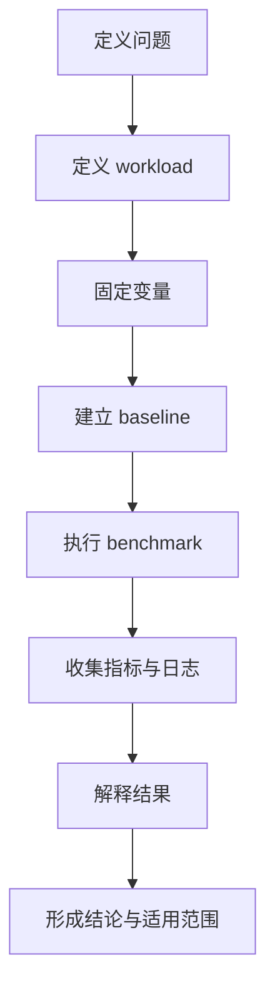
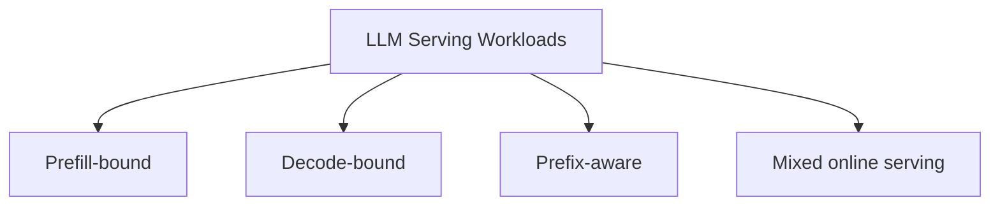
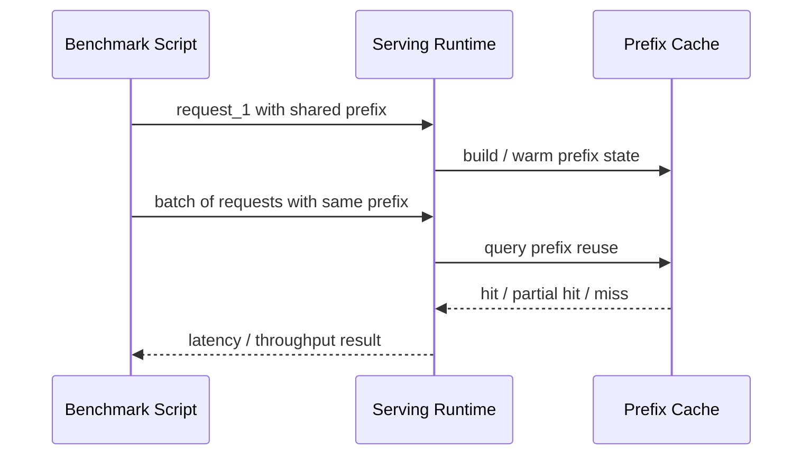
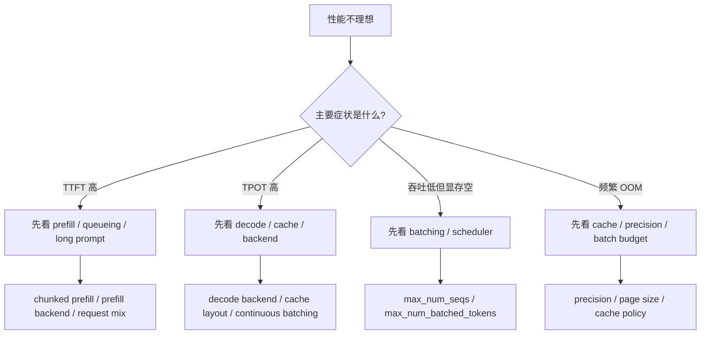
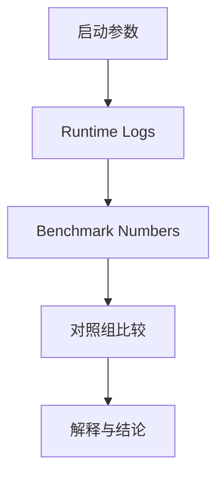
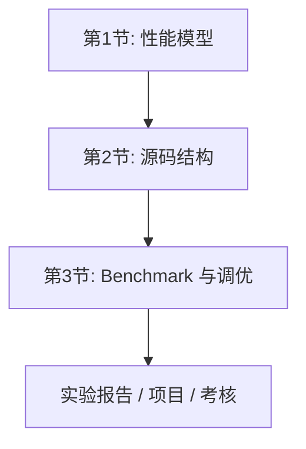

# 第 3 节：Benchmark、调优与实验设计：把“会跑”变成“会研究”

## 本节导读

前两节我们已经建立了两个层面的能力：

- 能把 LLM inference 理解成一个系统问题
- 能在 vLLM / SGLang 中找到这些系统问题对应的代码位置

但如果停在这里，你仍然很容易做出一种“看起来很工程、其实不够可信”的工作方式：

- 跑一个 benchmark 脚本
- 改几个参数
- 看到数字变大
- 得出“优化成功”的结论

真正高质量的 inference work 不是这样做的。

一个好的 benchmark 和一个好的实验报告，至少要同时满足三件事：

1. 结果可复现
2. 过程可解释
3. 结论和 workload 条件绑定明确

这也是本节的核心。

## 学习目标

完成本节后，你应该能够：

1. 设计一个基本可信的 inference benchmark。
2. 区分 prefill-bound、decode-bound、prefix-aware、mixed serving 四类 workload。
3. 根据瓶颈类型组织调优顺序，而不是随机扫参数。
4. 为 NVIDIA 与 Ascend 平台分别制定基础调优计划。
5. 写出结构化实验报告，并保留可验证的证据链。

## 1. Benchmark 到底在干什么

很多 benchmark 结果不可信，不是因为数字测错了，而是因为“被测对象”根本没有定义清楚。

例如下面这些说法都很常见：

- “框架 A 比框架 B 快 30%”
- “切换某个 backend 后吞吐提升明显”
- “某个平台跑这个模型效果更好”

这些话如果没有附带 workload 条件和控制变量，几乎都不完整。

### 一个 benchmark 至少要回答五个问题

1. 测的是哪一类场景？
2. workload 是什么？
3. 固定了哪些变量？
4. 报了哪些指标？
5. 这个结论对哪些条件成立？

### 一张 benchmark 流程图



这张图的重点是：benchmark 不应该从“执行 benchmark”开始，而应该从“定义 workload”开始。

## 2. 先学会定义 workload

在 LLM serving 里，“测什么”比“怎么测”更重要。

## 2.1 四类最重要的 workload



下面分别解释。

## 2.2 Prefill-bound workload

典型特征：

- 输入长
- 输出短
- prompt ingestion 成本显著
- TTFT 比 TPOT 更敏感

这类 workload 更容易暴露：

- prefill backend 的差异
- 长上下文显存压力
- chunked prefill 是否带来收益

如果你把这类 workload 和 decode-bound workload 混在一起看，很容易把结论说错。

## 2.3 Decode-bound workload

典型特征：

- 输入短或中等
- 输出长
- 需要大量逐 token decode

它更容易暴露：

- KV cache layout 问题
- bandwidth / cache 压力
- scheduler 与 continuous batching 的效果
- decode backend 的差异

这类 workload 通常更能体现 TPOT、ITL 和 tail latency。

## 2.4 Prefix-aware workload

典型特征：

- 多个请求共享长前缀
- prefix cache 命中率会显著影响结果

现实中它并不少见：

- 相同 system prompt 的聊天请求
- agent / tool 场景下统一模板
- 批量评测时共享 instruction

它特别适合教学和实验，因为它能同时考察：

- 你是否理解前缀复用的系统意义
- 你是否知道怎么构造共享前缀 workload
- 你是否知道如何验证 cache 或 backend 是否真的生效

## 2.5 Mixed online serving workload

典型特征：

- 请求动态到达
- 长短请求混合
- 更接近真实线上服务

它最有现实意义，但也最难做成可解释的课堂实验，因为：

- 控制变量多
- 结果波动大
- 到达过程会显著影响 tail latency

因此教学中更推荐先从前三类更可控 workload 开始。

## 3. 指标体系：不能只报 `tokens/s`

## 3.1 延迟指标

- `TTFT`
- `TPOT`
- `ITL`
- `P50 latency`
- `P95 latency`
- `P99 latency`

这些指标回答的是：

- 用户多久能看到第一个 token
- 后续 token 到达是否稳定
- 尾部请求是否被系统拖垮

## 3.2 吞吐指标

- `requests/s`
- `input tokens/s`
- `output tokens/s`
- `total tokens/s`

这些指标回答的是：

- 单位时间内系统处理能力如何
- 你的优化是更偏向吞吐，还是更偏向低延迟

## 3.3 资源指标

- 显存或 NPU memory 占用
- OOM 次数
- timeout 次数
- failed request 数

资源指标很重要，因为很多“更快”的配置，其实是在用稳定性和服务容量做交换。

### 一个常见误区

只报 `output tokens/s` 很容易掩盖问题，因为：

- TTFT 可能变差很多
- P95 可能变得更糟
- 失败率可能上升
- baseline 和优化版可能用了不同的 workload

因此真正有解释力的表格，至少应该同时给出“延迟 + 吞吐 + 资源”三类指标。

## 4. 控制变量：实验设计中最容易偷懒、也最容易出问题的部分

## 4.1 必须明确的变量

- 模型版本
- tokenizer 版本
- 精度
- 硬件型号
- 卡数
- 并行方式
- prompt length 分布
- output length 分布
- 请求到达模式
- benchmark 持续时长
- warmup 策略
- prefix cache 是否开启
- attention backend
- prefill / decode backend

## 4.2 为什么“平均长度相同”不等于“workload 相同”

例如：

- workload A：一半是 32 token，一半是 4096 token
- workload B：全部是 2064 token

它们的平均输入长度可能接近，但对系统行为的影响完全不同：

- A 的 tail latency 更容易被长请求拖动
- scheduler 在 A 中更容易遇到异质批次
- cache 压力和排队行为也不一样

所以真正严谨的 benchmark，不应该只报平均长度，而应该描述长度分布。

## 5. 看现成 benchmark 代码：从脚本反推实验设计

本节不只讲原则，还要把原则映射到真实代码。

## 5.1 vLLM 的 offline throughput benchmark

在 `vllm/vllm/benchmarks/throughput.py` 中，你会看到类似下面的逻辑：

```python
llm = LLM(**dataclasses.asdict(engine_args))
...
for request in requests:
    prompts.append(prompt)
    sampling_params.append(
        SamplingParams(
            n=n,
            temperature=1.0,
            top_p=1.0,
            ignore_eos=True,
            max_tokens=request.expected_output_len,
        )
    )
...
outputs = llm.generate(prompts, sampling_params, use_tqdm=True)
```

这段代码告诉我们几件很重要的事：

1. benchmark 并不是在“随机 generate”，而是在构造一组 `requests`
2. 每个 request 都带有 prompt 和期望输出长度
3. benchmark 的本质是：给定一个请求集合，在固定参数下测完整运行时间

也就是说，benchmark 的核心不是 `generate()` 本身，而是 `requests` 的分布。

## 5.2 vLLM 的 online serving benchmark

`vllm/vllm/benchmarks/serve.py` 更有教学价值，因为它显式区分了：

- request throughput
- output token throughput
- TTFT
- TPOT
- ITL
- E2E latency

只看这个脚本的 metrics dataclass，你就能看出一件事：

> 一个成熟的 serving benchmark，从设计上就不应该只盯吞吐。

这也说明，如果你要自己写 benchmark，最先应该学的是“指标设计”，而不是“怎么发请求”。

## 5.3 SGLang 的 shared-prefix benchmark

在 `sglang/benchmark/bench_in_batch_prefix/bench_in_batch_prefix.py` 中，有一段非常适合教学的逻辑：

```python
def test_batch_by_batch_with_hint(all_prompts, gen_len):
    backend.flush_cache()
    for i in range(len(all_prompts)):
        # Send a hint to cache the prefix
        text_qa.run_batch(list(zip(all_prompts[i][:1], [gen_len])))
        # Send the batch
        text_qa.run_batch(list(zip(all_prompts[i], [gen_len] * len(all_prompts[i]))))
```

这段代码的价值不在于复杂，而在于它非常明确地展示了 prefix-aware workload 是如何被构造出来的：

- 先人为制造共享前缀
- 再先送一个“hint”去建立 prefix cache
- 然后再送整个 batch

从系统实验角度看，这已经是一个非常典型的“结构化 workload”例子。

## 5.4 用图表示这个 shared-prefix benchmark



这类 benchmark 特别适合作为课程实验，因为它不仅能测数字，还能测学生是否真正理解“共享前缀 -> cache reuse -> latency/throughput 变化”这条因果链。

## 6. 怎样建立 baseline

很多人会忽略 baseline 的重要性，直接去“找最快配置”。但如果 baseline 不清晰，优化版就失去了参照物。

## 6.1 一个好的 baseline 应该满足什么条件

- 配置清晰
- 不依赖隐藏技巧
- 能稳定跑通
- 代表“合理默认值”，而不是明显故意放慢的配置

### baseline 不应该是什么

- 明显不合理的小 batch 限制
- 故意关闭必要功能
- 与优化版使用不同 workload
- 与优化版使用不同精度却不说明

## 6.2 baseline 到优化版的关系

更好的思路不是“找一个最快配置”，而是做一条清晰的优化链：

1. baseline
2. 调整 batch / cache 参数
3. 调整 attention backend
4. 调整 prefill / decode backend
5. 引入 graph / compile / 更激进精度

这样做的好处是，你能解释每一步的收益来源。

## 7. 调优顺序：先按系统层次，再按参数名

很多人调优时会把几十个参数一起扫，这样虽然可能碰巧撞到一个好点，但很难解释结果来自哪里。

更好的方式，是先按系统层次组织。

## 7.1 第一层：改变系统形态的参数

- `max_num_seqs`
- `max_num_batched_tokens`
- page / cache 相关参数
- 并发设置

这些参数最容易改变 request 如何共享系统资源。

## 7.2 第二层：改变执行路径的参数

- `attention_backend`
- `prefill_attention_backend`
- `decode_attention_backend`
- graph / compile 开关

这些参数更接近具体执行后端。

## 7.3 第三层：改变数值与内存行为的参数

- `bf16`
- `fp16`
- `fp8`
- 量化配置

这些参数会同时影响：

- 内存占用
- 带宽需求
- 可用 backend / kernel

## 7.4 一张调优决策图



这张图的目的不是覆盖所有情况，而是帮助你形成“先判断瓶颈类型，再挑参数”的习惯。

## 8. NVIDIA 平台：如何组织基础实验

NVIDIA 平台适合承担这门课中的“方法论训练”角色，因为：

- 生态成熟
- backend 选择多
- benchmark 和 profiling 工具丰富

## 8.1 至少设计两类 workload

### Workload A：短输入、短输出

目标：

- 观察 launch overhead
- 观察 TTFT
- 观察 scheduler 对 tail latency 的影响

### Workload B：长输入、长输出

目标：

- 观察 prefill / decode 比例变化
- 观察 cache 压力
- 观察 batch 规模增长后的收益与代价

### Workload C：共享长前缀

如果课程允许，建议加这一类，因为它特别适合串起：

- prefix cache
- batch prefill
- backend 生效验证
- workload-aware benchmark

## 8.2 NVIDIA 平台调优的推荐顺序

1. 固定 workload
2. 建 baseline
3. 调 batch / cache 相关参数
4. 调 attention backend
5. 再尝试 prefill / decode backend 分离
6. 最后看 graph / compile / 更激进精度

这比“一次扫几十个参数”更有解释力。

## 9. Ascend 平台：为什么不能直接照搬 NVIDIA 经验

当你进入 Ascend 平台后，很多事情都会变：

- 可用 backend 变了
- graph / compile 机制变了
- custom ops 与通信栈变了
- plugin 层承担了更多职责

因此，Ascend 上的调优应该先问：

1. 哪些逻辑仍然复用 vLLM 主干？
2. 哪些逻辑已经由 plugin 接管？
3. 当前瓶颈更像框架问题、平台问题，还是 backend 问题？

只有先回答这三个问题，后面的数字才有解释意义。

## 10. 实验报告：结果表不是报告

一个像样的实验报告，至少要包含四部分。

## 10.1 环境定义

- 硬件环境
- 软件环境
- 模型版本
- tokenizer 版本
- 精度

## 10.2 workload 定义

- 输入长度分布
- 输出长度分布
- 并发数
- 到达模式
- 是否共享前缀
- warmup 方式

## 10.3 配置与命令

- baseline 配置
- 优化版配置
- 启动命令
- 环境变量
- backend 设置

## 10.4 结果与解释

- 指标表
- 日志证据
- 对结果变化的解释
- 失败尝试与排查过程
- 结论适用范围

### 一张证据链图



这张图非常重要，因为它说明：

- 只交一张结果表不够
- 只交一条命令也不够
- 结论必须由“配置 -> 日志 -> 数字 -> 对照”整条证据链支撑

## 11. 把三节课的主线闭合起来



三节课真正想培养的不是“会调某个参数”，而是下面这套能力：

1. 先定义 workload
2. 再判断瓶颈
3. 再设计 baseline
4. 再做分层调优
5. 最后用证据链支撑结论

这套方法一旦建立，不只是对 vLLM 或 SGLang 有用，对以后读别的 serving 系统、做别的平台实验也有用。

## 12. 本节总结

本节最重要的收获应该是：

- benchmark 不是跑脚本，而是定义实验
- workload 定义比框架名字更重要
- 不能只看吞吐，必须同时看延迟、资源和失败情况
- baseline 必须合理清晰，优化链必须可解释
- prefix-aware workload 是非常适合教学与考核的系统实验类型

## 13. 思考题

1. 为什么只报 `tokens/s` 的 benchmark 往往价值有限？
2. 为什么 prefix-aware workload 比随机 workload 更容易放大 cache 与 backend 的差异？
3. 为什么“最优 backend”不能脱离 workload 和硬件来谈？
4. 如果你在 NVIDIA 上调出的最佳配置搬到 Ascend 后失效，最先应该怀疑哪些层？

## 14. 课后练习

### 练习 1

设计一套最小 benchmark 方案，要求：

- 至少包含两类 workload
- 至少汇报五个指标
- 至少固定八个变量

### 练习 2

为一个共享长前缀场景设计 baseline 与优化版实验，要求写清：

- workload 定义
- 你预计哪个环节会成为瓶颈
- 你打算如何验证某个 backend 或 cache 策略真的生效

### 练习 3

以 NVIDIA 和 Ascend 为两类平台，各写一个“你最先想调的三个参数”，并解释为什么。
